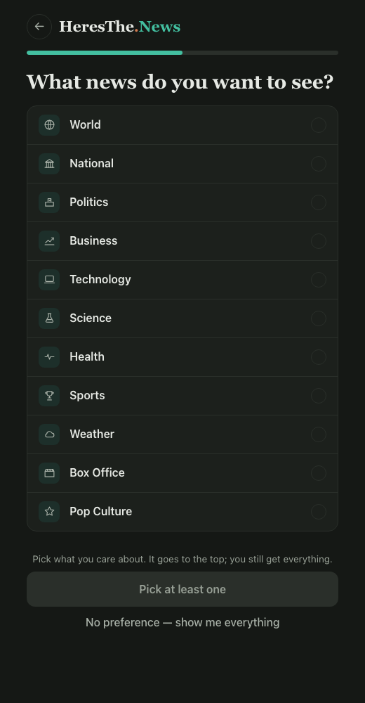
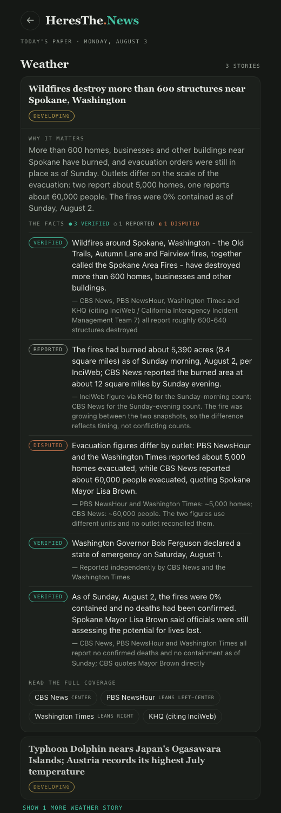
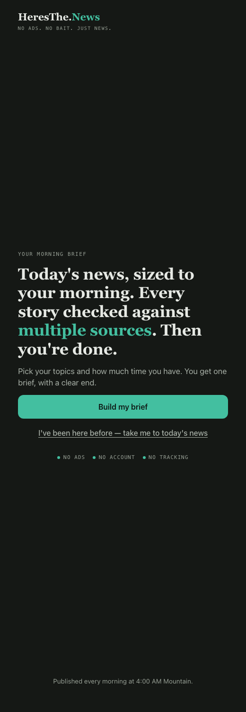
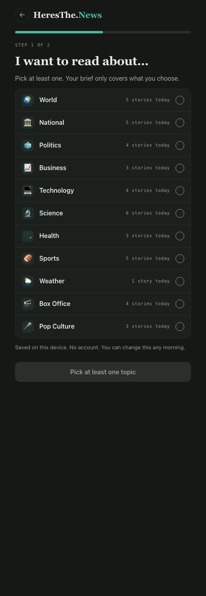
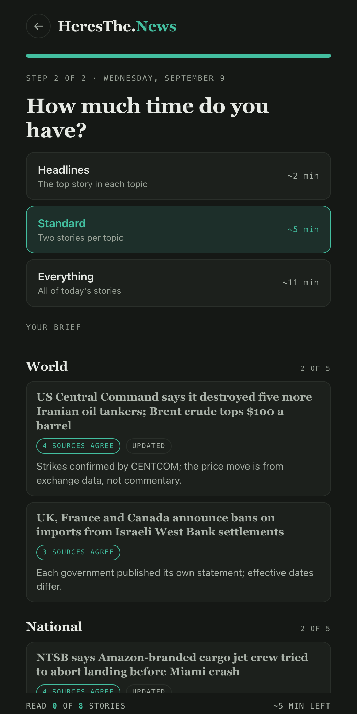
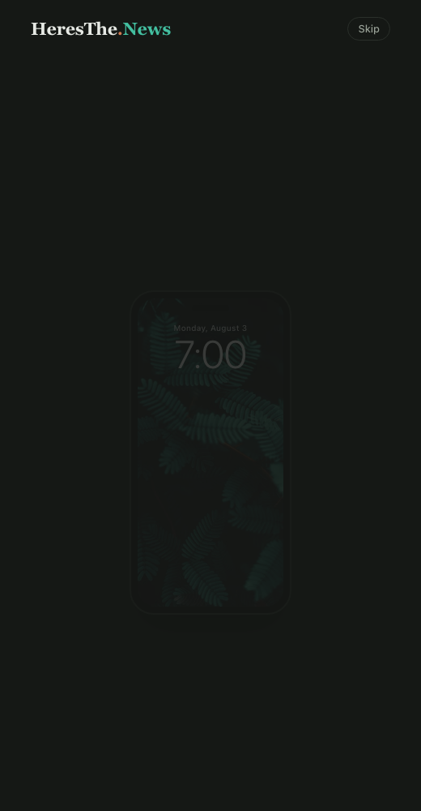
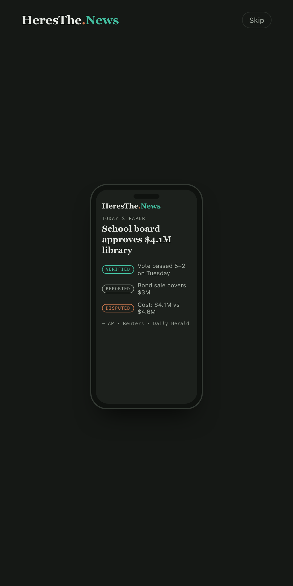

# HeresThe.News — First Three Screens

**Live prototype:** https://kdavis5111.github.io/htn-first-three-screens/ (add `?skip=1` to jump past the intro; `?at=11` pauses the intro at that second)
**Repo:** https://github.com/kdavis5111/htn-first-three-screens
**History:** [first commit `d8bd24c`](https://github.com/kdavis5111/htn-first-three-screens/commit/d8bd24c) is the agent's untouched output from [BRIEF.md](BRIEF.md); every change after it is on the `refine-signifiers` branch, merged through [pull request #1](https://github.com/kdavis5111/htn-first-three-screens/pull/1).

[heresthe.news](https://heresthe.news) is a site I already run: a daily news brief assembled each morning from 46 outlets chosen to disagree with each other, keeping only what they agree happened, with every claim labeled *verified*, *reported*, *disputed* or *developing* and every source named. This assignment mocks up the three screens a **first-time visitor** should meet, since today they land on a wall of headlines.

---

## 1. Need, persona, capability, value

| | |
|---|---|
| **Need** | Every morning, a phone reader who wants to know what happened has to scroll past ads, pop-ups and slanted headlines with no sense of when they are done, so they either skim without trusting anything or give up. |
| **Persona** | Reads news once a day, in the morning, on a phone, in a five-to-ten-minute window. Has quit at least one news app because of constant notifications, tons of ads, being "forced" to subscribe, and intense bias. |
| **Capability** | Read today's news with every fact labeled by how well it is confirmed and every source named. |
| **Value** | **Certainty.** You know what actually happened and how sure to be about each part of it, and then you are done for the day. 1 report each morning, no need to keep checking your phone. |

## 2. The three screens

| # | Screen | Its one job | Why it earned a slot | Design question it helps answer |
|---|---|---|---|---|
| 1 | **Start** | Signal the value and the one action. A short intro plays once: a phone lock screen, a HeresThe.News notification, a zoom into the app, one headline whose facts arrive labeled *verified / reported / disputed* with their sources. It resolves into **"No ads. No bait. Just news."** revealed one phrase at a time on a single line, which the wordmark then replaces, followed by a single button, **Read Today's News**. | The live site's landing is the feed itself, so a first-timer never sees what makes it different. This screen shows the mechanism in ten seconds instead of describing it. | Does a first-time visitor understand what the site does and what to tap before reading anything? |
| 2 | **Your topics** | Let the reader shape the paper. The live site's own words, *"What news do you want to see?"*, a list with line icons, **Show my paper** disabled until at least one pick, *No preference, show me everything* as the escape, and a live line, *"World · Tech first, then everything else"*, that updates as topics are toggled. Chosen topics are **prioritised, not filtered**: they go to the top and the rest of the paper still follows. | The live site has this feature but buries it after the first section; first-timers never find it. Showing it as the first step makes the reader's control over the paper discoverable, and prioritising rather than filtering keeps the promise that you still get *all* the news. | Do readers recognise the list as *their* control over the paper, and does the disabled button read as a constraint rather than a bug? |
| 3 | **Today's paper** | Show the product working. Every category of the Aug 3 edition, with the reader's chosen topics first under *Your topics* and the rest under *Everything else*. The site's real story component is open on one story: *Why it matters*, five facts with status chips, and every source named with its lean tag. Ends with **"That's everything for today."** | It is the capability itself, not a picture of it. Every element on it exists on heresthe.news today, and it shows the effect of the choice made on screen 2. | When a reader opens a story, do the labels and named sources read as "this has been checked" without explanation? And do they notice their topics came first? |

The flow is Start → Your topics → Today's paper. Every screen returns to Start from the masthead (logo, and a back arrow on screens 2 and 3). Three screens is the cap; there is no fourth.

### The three screens, final

| Screen 1 — Start | Screen 2 — Your topics | Screen 3 — Today's paper |
|---|---|---|
|  |  |  |
| The moment the intro lands on the motto. It then resolves to the wordmark and the *Read Today's News* button ([resting state](docs/after/landing-rest.png)). | Science and Sports picked; the line under the list shows the effect before the reader commits. | Chosen categories first under *Your topics*, the rest under *Everything else*; the wildfire story open with labeled facts and named sources ([whole page](docs/after/paper-full.png)). |

## 3. Design question plan

*Questions and predictions only; no feedback has been collected yet.*

| Group | What I would ask | What I predict they will say | Which part of the prototype the prediction rests on |
|---|---|---|---|
| Need | "Tell me about the last time you tried to catch up on the news in the morning. What did you end up doing?" | They opened a social feed or a news app, scrolled for a while, and stopped without feeling finished. | The landing's motto and the paper's "That's everything for today" both bet on *finishing* being a felt need. |
| Value | "If this worked the way you wanted, what one or two words describe what you'd get out of it?" | "Trust" or "quick." Not "certainty," which is my word, not theirs. | The status chips and the named sources on Today's paper. If they say "quick" and not "trust," the labels are not landing. |
| Persona | "How often does this come up for you, and what are you usually doing when it does?" | Every morning, on the phone, in bed or before class, with about five minutes. | The intro's lock-screen notification at 7:00 is aimed at exactly that moment. |
| Capability | "I'm going to show you this screen for five seconds. (Hide it.) What does this product do?" — the Start screen after the intro | "News without ads." Fewer will say "checked across sources," because that idea lives in the intro, not in the resting landing. | The motto carries the *no ads* claim; the multi-source claim is only in the animation, so it is at risk of being missed. |
| Capability | "Click around on Today's paper and tell me what the labels mean." | *Verified* and *disputed* will be read correctly. Some will read *reported* as a synonym for verified rather than "one source so far." | The `reported` chip is grey and unexplained on screen 3; the live site explains it in a footnote the mock-up does not carry. |

## 4. Design justification and first read

I opened the live URL on my phone as if I had never seen it.

**Does the landing signal the primary capability and fundamental value at first glance, before reading?** Partly. The value lands before reading: a dark, ad-free screen, a wordmark, three short lines. The capability lands through the intro, which is watched rather than read, and through the button, *Read Today's News*. A visitor who skips the intro sees the wordmark and the button only; the motto lives inside the intro, so the value claim depends on the intro being watched. That is a deliberate trade for a calmer resting screen, and it is the first thing I would test with the five-second question in section 3.

**Does every element on the landing earn its place?** Now, yes. The first AI output did not: it had a three-line headline, a lede sentence, a row of three reassurance chips, a footer line about the publish time, and two buttons of near-equal weight. That is *signifier interference* in the deck's terms. Nothing was dominant, so nothing signaled. The resting landing now has three things: wordmark, one button, and a demoted *Replay intro* link.

**What belongs together on each screen, and which Gestalt principle communicates it?**
- *Proximity*: on Today's paper, the facts sit directly under "The facts" and each source line sits directly under its fact, so fact and evidence read as one unit. The reader's chosen categories sit together under one *Your topics* divider.
- *Similarity*: every status chip has the same shape and type; only colour changes, so colour alone encodes status. On Topics, every selected row shares the same green tint and tick, so "chosen" reads as one state.
- *Common region*: each story is one card; the lock-screen notification is one card; the topic list is one bordered region.
- *Continuity*: the progress bar on Topics is a single line, so "step 1 of 2" reads without a label.

**Do screens 2 and 3 stay on mission, and can you return to the landing from everywhere?** Screen 2 is a choice screen, which the assignment warns about; it stays on mission because it is a real feature of the live site rather than an invented settings page, because the live line shows the effect as you tap, and because the choice is honoured on the very next screen. Screen 3 is the product itself, with the reader's choice visible at the top of it. Both screens have a back arrow and a logo link to Start.

**What did the AI initially get wrong, skip, or oversimplify, and what did I change?**
1. **Too much copy competing on the landing.** Cut to one motto and one button. *Reason:* interference; the affordance sentence was not dominant.
2. **An abstract "demo" graphic of grey bars.** It signified nothing; a reader could not tell the bars were stories. Replaced twice, finally with a phone that shows the actual product. *Reason:* clarity, matching the reader's mental model.
3. **An invented "how much time do you have?" picker.** It looked good and did not reflect how the site works; the site has no time sizing. Removed. *Reason:* a signifier for a capability that does not exist is a false affordance.
4. **A reading-style picker as the third screen.** A settings page, the failure the assignment names. Removed. The topics step became screen 2 and the paper became screen 3, so the last thing a visitor sees is the product honouring their choice.
5. **Topics filtered the paper.** The first version dropped every category you did not pick. Changed to prioritise instead: chosen categories first, everything else after. *Reason:* the site's promise is that you get all the news; filtering broke the reader's mental model of "a paper."
6. **Emoji icons on the topic list.** They read as cheap and inconsistent. Replaced with line icons in one stroke weight. *Reason:* the three screens have to look like one product.
7. **The wordmark's clay dot was missing.** Restored. Small, but it is the brand.

**Which design question motivated each important change?** The landing rewrite came from *"does a first-timer know what to tap before reading?"*: the answer was no while five elements competed. The removal of the time and style pickers came from *"do screens 2 and 3 show the product working?"*: a picker is not the product. The topics live line and the prioritise-not-filter change came from *"does the reader see the effect of their choice, and do they still trust they got everything?"*.

### Before and after

| | First AI output ([commit `d8bd24c`](https://github.com/kdavis5111/htn-first-three-screens/commit/d8bd24c)) | Final |
|---|---|---|
| **Screen 1 — Start** |  |  |
| | Eyebrow, three-line headline, lede, primary and secondary buttons, three reassurance chips, footer. Nothing dominant. | The intro ends on *No ads. No bait. Just news.*, one phrase at a time; the wordmark then replaces it and one button appears ([resting state](docs/after/landing-rest.png)). |
| **Screen 2 — Your topics** |  |  |
| | Emoji icons, story counts on every row, helper paragraph, step label, and the choice *filtered* the paper. | Line icons, one live line showing the effect, and the choice *prioritises* the paper instead of filtering it. |
| **Screen 3 — Today's paper** |  |  |
| | The first output had a time-sizing picker here, a capability the site does not have. | The paper itself: chosen categories first, a real story open with labeled facts and named sources. |
| **Screen 1, inside the intro** |  |  |
| | First beat: a phone, a HeresThe.News notification at 7:00. | Last beat before the motto: one headline, facts labeled verified / reported / disputed, sources named. |

---

### Notes
- Built with plain HTML, CSS and JavaScript; the intro uses [GSAP](https://gsap.com) from cdnjs. No build step.
- The story on Today's paper is reproduced verbatim from the HeresThe.News edition of Aug 3, 2026, including its source lines. "Read the full coverage" links leave the prototype for the original outlets.
- Lock-screen wallpaper: photo from Unsplash (free to use under the Unsplash license).
- Directed by Kendrick Davis; built with Claude Code as the AI agent. The agent's first output is the first commit; the direction and every revision decision were mine.
